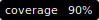

# NameGuard Python




This repository contains the core logic for NameGuard, a python library, web API server, and AWS Lambda handler.

## Getting Started

### Using the public API

NameGuard is hosted at <https://api.nameguard.io>

You can make a basic request to the API like this:

```bash
curl https://api.nameguard.io/inspect-name/mainnet/nick.eth
```

The API documentation is available at <https://api.nameguard.io/redoc> or <https://api.nameguard.io/docs>.

### Running your own NameGuard instance

#### Env variables

```bash
AWS_ROLE - AWS Role used by GitHub actions to create the CloudFormation infrastructure for deploying NameGuard as an AWS Lambda and pushing the latest build image to AWS ECR.
SLACK_WEBHOOK_URL - Slack webhook url used by GitHub actions to send notifications of deployment success or failure to the dev team's slack channel.
```

#### Installing the library

NameGuard is available as a Python library on [PyPI](https://pypi.org/project/nameguard/). You can install it with `pip`:

```bash
pip install nameguard
```

#### Setting Provider URIs

NameGuard uses the specified Provider endpoint (e.g. Alchemy, Infura, your own Ethereum node, etc...) for `secure-primary-name/`. Provider endpoints have to be set by environment variables, e.g.:

```bash
export PROVIDER_URI_MAINNET=https://eth-mainnet.g.alchemy.com/v2/[YOUR_ALCHEMY_API_KEY]
export PROVIDER_URI_SEPOLIA=https://eth-sepolia.g.alchemy.com/v2/[YOUR_ALCHEMY_API_KEY]
export ALCHEMY_URI_MAINNET=https://eth-mainnet.g.alchemy.com/v2/[YOUR_ALCHEMY_API_KEY]
export ALCHEMY_URI_SEPOLIA=https://eth-sepolia.g.alchemy.com/v2/[YOUR_ALCHEMY_API_KEY]
export ENS_SUBGRAPH_URL_MAINNET="https://gateway-arbitrum.network.thegraph.com/api/[YOUR_SUBGRAPH_API_KEY]/subgraphs/id/5XqPmWe6gjyrJtFn9cLy237i4cWw2j9HcUJEXsP5qGtH"
export ENS_SUBGRAPH_URL_SEPOLIA="https://gateway-arbitrum.network.thegraph.com/api/[YOUR_SUBGRAPH_API_KEY]/subgraphs/id/DmMXLtMZnGbQXASJ7p1jfzLUbBYnYUD9zNBTxpkjHYXV"
```

#### Starting the web server

A FastAPI application is included in the `nameguard.web_api` module. The default installation from PyPI does not include an ASGI server, so you will need to install one separately. For example, to install [uvicorn](https://www.uvicorn.org):

```bash
pip install 'uvicorn[standard]'
```

You can start the web server with:

```bash
uvicorn nameguard.web_api:app
```

Make an example request:

```bash
curl -d '{"name":"nick.eth", "network_name": "mainnet"}' -H "Content-Type: application/json" -X POST http://localhost:8000/inspect-name
# {
#   "rating": "pass",
#   "risk_count": 0,
#   "highest_risk": null,
#   "name": "nick.eth",
#   "namehash": "0x05a67c0ee82964c4f7394cdd47fee7f4d9503a23c09c38341779ea012afe6e00",
#   "normalization": "normalized",
#   "checks": [...],
#   "labels": [...],
#   "canonical_name": "nick.eth",
#   "title": "Looks Good",
#   "subtitle": "All security checks passed!",
#   "beautiful_name": "nick.eth"
# }
```

## Development

### Running tests

Before running nameguard tests, make sure you have installed the
required dependencies (along with dev dependencies).
They are installed by default using poetry:

```bash
poetry install
```

To run nameguard tests locally, just run pytest from the root directory:

```bash
pytest ./api/tests/
```

NameGuard also provides an option to run API tests (`api/tests/test_api.py`)
against a remote host (e.g. Lambda) where a NameGuard instance is running.
To enable this, you will need to set an environment variable
`LAMBDA_ROOT_URL` to specify the remote host URL.

This can be done like this:

```bash
LAMBDA_ROOT_URL=https://api.nameguard.io poetry run pytest api/tests/test_api.py
```

### Using the AWS Lambda handler

NameGuard includes a handler for [Amazon AWS Lambda](https://aws.amazon.com/lambda/). It is available in the `nameguard.lambda` module. You can use it to create a Lambda function that will respond to HTTP requests. It uses the [mangum](https://mangum.io) library.

Check out the included [Dockerfile](./Dockerfile) for an example of how to build a Lambda container image.

### Disable monkeypatch tests

By default, the tests are using mock responses from external APIs. If you want to run tests using real requests to external APIs then set `MONKEYPATCH=0`.

```bash
MONKEYPATCH=0 poetry run pytest
```

## License

Licensed under the MIT License, Copyright © 2023-present [NameHash Labs](https://namehashlabs.org).

See [LICENSE](./LICENSE) for more information.
